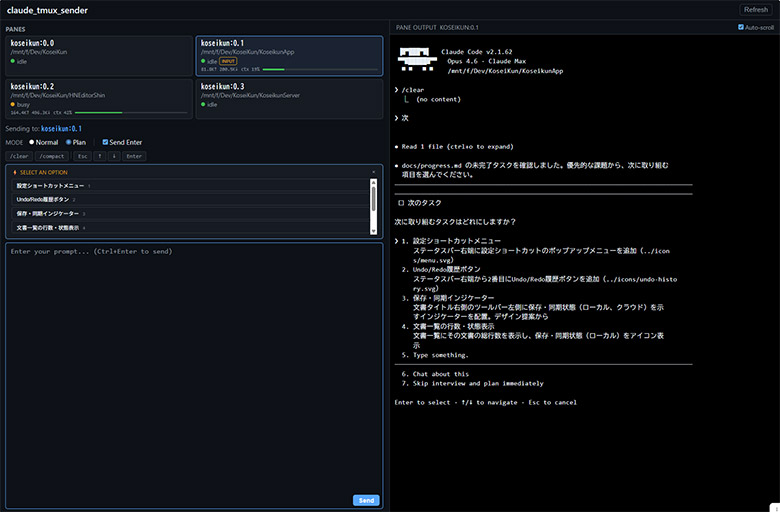

# ccl_tmux_sender

## Overview

[日本語版 README はこちら](README_ja.md) | **English**

A tool that lets you operate multiple Claude Code sessions from a web browser.
It solves the hassle of typing long prompts directly in the terminal.
You can also minimize the terminal running tmux and keep it out of the way.



## Requirements

The following are required on the environment running tmux (Claude Code CLI).
Tested on WSL (Ubuntu) on Windows 11.

- WSL (Ubuntu)
- Bash
- Python 3
- tmux
- Claude Code CLI

## Quick Start

```bash
# 1. Grant execute permissions
chmod +x ctxsend ctxlist ctxserver

# 2. Start the server
python3 ctxserver                # default port 5005
python3 ctxserver --port 8080    # specify port

# 3. Open http://localhost:5005 in a web browser
```

### Features

- Displays a list of tmux panes (idle/busy status, token usage, etc.)
- Select a pane → enter a prompt → click Send (Ctrl+Enter also works)
- Auto-refreshes status every 5 seconds

### Startup Sample

- See `tmux-start_sample.sh` for a sample that starts tmux with 4 panes
- You can prevent text wrapping in the Web UI when the terminal running tmux is resized small:

```bash
# hoge is the session name
tmux set-option -t hoge:0 window-size manual
tmux resize-window -t "hoge:0.0" -x 180 -y 50
```

## CLI Tools

The core is implemented as shell scripts and can also be run directly from the terminal.

### ctxsend — Send Prompt

```bash
./ctxsend <session_id:window.pane> "prompt"

# Examples
./ctxsend hoge:0.0 "hello"
./ctxsend hoge:0.2 "refactor the database module"
```

### ctxlist — List Panes

```bash
./ctxlist              # table view
./ctxlist --json       # JSON output
./ctxlist --all        # show panes not running Claude Code too
```

Example output:

```
TARGET               COMMAND    STATUS   CWD
------               -------    ------   ---
hoge:0.0         claude     idle     /mnt/path/to/MyProject
hoge:0.1         claude     busy     /mnt/path/to/OtherProject
```

## Token Usage Display (Optional)

By configuring the following, the Web UI will display token usage and other
information for each pane using Claude Code's status line feature.

### Setup

1. Grant execute permissions

```bash
chmod +x ctx-statusline
```

2. Add to `~/.claude/settings.json`

```json
{
  "statusLine": {
    "type": "command",
    "command": "/path/to/ctx-statusline"
  }
}
```

3. Restart Claude Code.

### Displayed Information

| Item | Description |
|------|-------------|
| Input tokens (↑) | Cumulative input tokens for the session |
| Output tokens (↓) | Cumulative output tokens for the session |
| ctx % | Context window usage |

The context usage bar changes color: green below 50%, yellow at 50–80%, and red at 80% or above.

## File Structure

```
ctxsend          CLI send tool (bash)
ctxlist          Pane listing tool (bash)
ctxserver        Web server (python3)
ctx-statusline   Status line script (python3)
static/
  index.html     Web form (vanilla HTML/JS/CSS)
```

## How It Works

Uses tmux's `send-keys` to send keystrokes via PTY.

```bash
tmux send-keys -t <target> -l "prompt"   # -l: literal send
tmux send-keys -t <target> Enter          # Enter to execute
```

## Notes

- Please limit use to local environments (not recommended for public server environments).
- It may take a few seconds for actual tmux content to be reflected in the Web UI.
- If Claude Code is generating a response, text may enter the input buffer but not be sent immediately.
- Sending to the same pane simultaneously may cause characters to be mixed.
